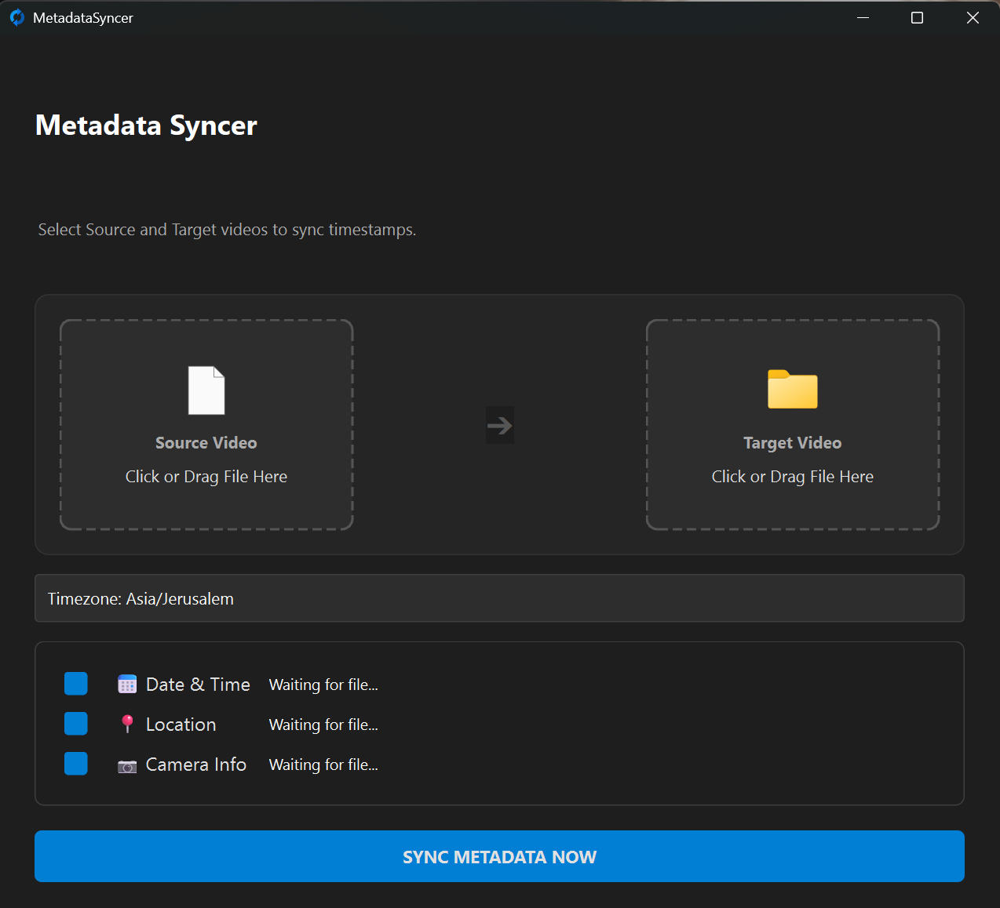

# Metadata Syncer

**Metadata Syncer** is a handy GUI utility, built with Python, designed to solve a common problem: restoring metadata to rendered video files.

I built this tool to easily copy that data from the original source file to the new rendered file, ensuring correct sorting and display in **Windows Explorer**, **QuickTime**, **Google Photos**, and **Immich**.



---

## 🚀 How to Use (For Users)

1.  Get the **`MetadataSyncer.exe`** file.
2.  **That's it!** The file is completely portable (Single-File). No installation required.
3.  Double-click to launch.
4.  **Source Video:** Drag & drop your original camera footage.
5.  **Target Video:** Drag & drop your rendered/edited file.
6.  **Review Data:**
    * The tool will automatically suggest a Timezone if GPS is found.
    * Use the **Checkboxes** to select what data to copy (Date, Location, Camera Info).
    * Check the **Preview Panel** to see the address and date calculations.
7.  Click **SYNC METADATA NOW**.

---

## ✨ Key Features

* **Smart Date Sync:** Copies original "Media Created" timestamp and calculates correct offsets.
* **Auto-Detect Timezone:** Automatically detects the correct Timezone based on the video's GPS coordinates.
* **Location Recovery:** Copies GPS coordinates and provides a **Live Preview** with a real-world address (Reverse Geocoding).
* **Camera Tech Data:** Restores camera make, model, ISO, aperture (F-Stop), and shutter speed.
* **Modern UI:** Dark mode interface with Drag & Drop support and a visual difference preview.

---

## Platform Support

Currently, this project is for **Windows only**. While the core Python logic is cross-platform, the build script (`build.bat`) and dependency handling are specific to Windows.

---

## 🛠️ Development

If you want to modify the code or build it yourself:

### 1. Prerequisites
Open a terminal in the root folder and install the required libraries:

```bash
pip install PyQt6 pyinstaller tzdata geopy timezonefinder
```

### 2. Prepare Development Environment
This project requires **ExifTool**, a powerful utility for metadata handling. A helper script is provided to download it for you.

Run the preparation script:
```bash
prepare-dev.bat
```
This will download and place `exiftool.exe` in the `third_party` directory. You only need to run this once.

### 3. Building from Source
Once the dependencies are ready, you can build the single-file executable by running:

```bash
build.bat
```

This script performs the following steps:
1.  **Calls `prepare-dev.bat`:** Ensures ExifTool is present.
2.  **Cleans Previous Builds:** Removes old `build` and `dist` folders.
3.  **Compiles the App:** Uses PyInstaller to bundle the Python script and all dependencies (including ExifTool) into a single `.exe` file.
4.  **Finalizes:** The final executable is placed in the `dist` directory.

### 4. Folder Structure
This project relies on a specific structure for development and building:

* **`src/`**: Contains the Python source code (`metadata_syncer.pyw`).
* **`assets/`**: Contains UI resources like `app_icon.ico`.
* **`third_party/`**: Contains `exiftool.exe` and its dependency folder `exiftool_files`.
    * *Note: These files are bundled INSIDE the final EXE during the build process.*